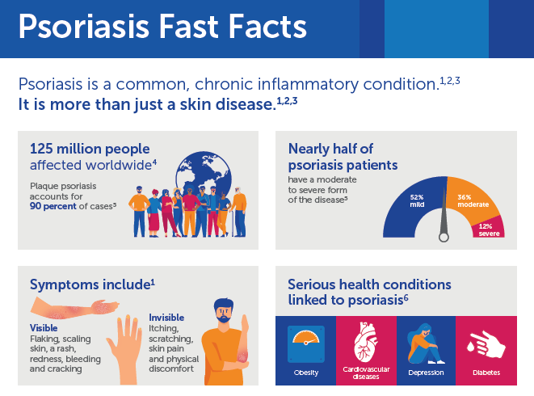
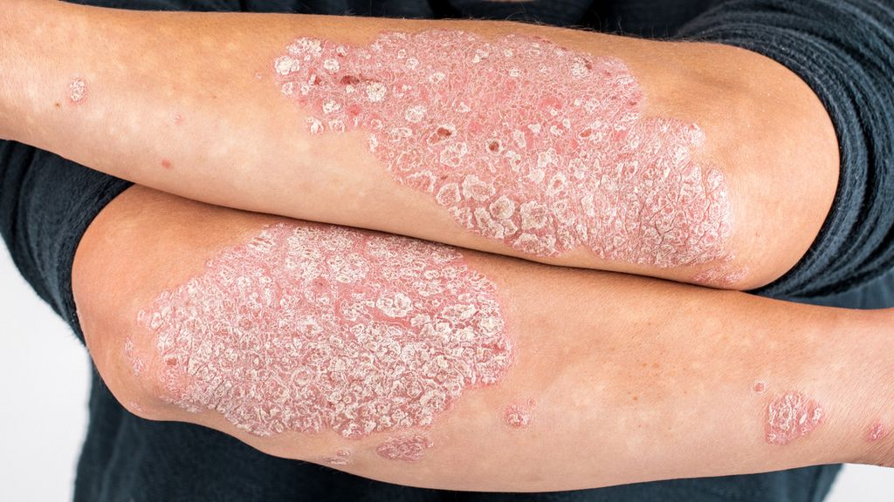

# Dealing with psoriasis in daily life 
---

It is a disease which affects the whole life. Since I grew up with a father and two siblings facing the world with psoriasis, I wanted to dig a bit deeper and figure out what it means to live with psoriasis. Also, I found some really cool apps to track the individual development and possible triggers. First, here are some quick facts about it:

## What is Psoriasis?

Psoriasis is a chronic, proliferative and inflammatory disease which mostly affects the skin. Once it appears, most people 
discover reddish and scaly spots firstly on their elbows and knees. As the disease develops, the spots grow and spread all over the body. 
The involved areas are itchy and tend to bleed after scratching. Also, psoriasis can affect the joints and eyes, but the most
common type is the plaque type which appears on the skin. There is no cure for psoriasis, and what's more, it goes down and up in episodes.
It is important to mention that the disease is not contagious; it is considered as an autoimmune disease which means that it is genetic. To clearly describe what happens to the body, i will now quote the [National Library of Medicine:](https://www.ncbi.nlm.nih.gov/books/NBK448194/#article-27961.s2)

>The pathophysiology of psoriasis involves infiltration of the skin by activated T cells which stimulate the proliferation of keratinocytes. This dysregulation in keratinocyte turnover results in the formation of thick plaques. Other associated features include epidermal hyperplasia and parakeratosis. In addition, the epidermal cells fail to secrete lipids which results in flaky and scaly skin, which is typical of psoriasis.

## Living with Psoriasis - is it easy?

There is more than just the itchy skin with plaque on it, and it is not easy to live with it at all.
Psoriasis is a very obvious disease, it is difficult to hide it unless one wants to fully cover their body when going out.
People tend to stare and point the finger on someone who looks different. Furthermore, suffering from psoriasis does affect the
everyday life by being painful when it comes to movements which include the affected areas of the body, e.g. walking if the knees are
affected by plaque. 

In addition, there is the need to scratch the afflicted areas due to the itching, which, among other things, 
makes people with psoriasis spread their dandruff at every place they sit or lay down. This might not be bad in general, since everyone has 
a vacuum or something else, but for the person themselves it can be a range from emberassing to really depressing.
Depressing is the key word for the next topic which comes up when talking about psoriasis - depression.

Psoriasis affects the entire life of a person. Rejection from other people who don't know the disease, the decreased life quality
and the whole process of seeing doctors, not to know if it ends someday can lead to 
depressions and other mental diseases.

## What one can do

Since psoriasis is a disease which can not be cured, it will last the entire life. All a patient for him- or herself can do is to keep their skin moisturized 
with appropriate skin cream and to use the hours of the day on which the sun comes out to kind of absorb the sun's rays. Also, a healthy lifestyle can be a great advantage. Exercising on a regular basis, having a varied diet as well as consulting a mental health counsellor are helpful when it comes to healing the skin, the mind, and the body. 

In severe cases, there is also the possibility to do phototherapy or even to take certain systemic drugs which supress the immune system of the patient. This kind of therapy is considered to take place only when the other known methods do not bring the desired outcome; to ease the suffering of the patient. 

In order to enhance the life quality on their own, patients must be aware of possible factors which trigger flare-ups and which kind of things are known to ease the symptoms. The most common thing which is known to ease the symptoms is the sun, while the most common flare-up-triggers are:
+ Stress
+ Alcohol
+ Smoking
+ Dry, cold weather.

But also, there is to mention that everyone has their own triggers which are to be found through own experiences.
To have an idea which groceries could help you or which ones you should avoid, here is an interesting video i found on youtube: 

<iframe width="560" height="315" src="https://www.youtube.com/embed/8BJyCyEcJSg" title="YouTube video player" frameborder="0" allow="accelerometer; autoplay; clipboard-write; encrypted-media; gyroscope; picture-in-picture; web-share" allowfullscreen></iframe>

---
## Smartphones and how they can actually help 

We are using our phones regularly throughout the day, so why not use it as some kind of tracking machine? As i looked up some quite interesting apps related to psoriasis, i came across several apps which certainly would be helpful to 1. track your symptoms and understand how they develop during the period of flareups and remission; and 2. help finding habits or stressors that have an impact on the manifestation of the skin disease.

### Tangerine

First app I highly recommend(because you can not only use it for psoriasis but for all aspects of life) would be Tangerine from Bitdreams OU, which is dedicated to your lifestyle and specificly helps you to improve things you want to be improved. In terms of psoriasis, you can track all your symptoms including skin appearance, stress level, (if needed) anxiety level, also factors that had affects on your daily life, e. g. visits at the doctor and so on. Tracking your emotional state and managing stress is vital to ease the symptoms of psoriasis and your mental health in general. Tangerine is an allround talent which is unfortunately only available at the [App Store](https://apps.apple.com/us/app/tangerine-self-care-goals/id1468882685). It is free to download, but with limited functionality. To unlock the entire experience, there is the option to subscribe annualy for 29.99$/year or monthly 4.99$/month. But it is not necessary to subscribe if you are fine with 5 habits you want to establish or to get rid of, this is the limitation value. 

### MyTherapy

If you want to keep it more medical (or serious, if you say so), there is another app which i can highly recommend: MyTherapy. It is free and available at the [App Store](https://apps.apple.com/gb/app/mytherapy-meds-pill-reminder/id662170995) and also at the [Google Play Store](https://play.google.com/store/apps/details?id=eu.smartpatient.mytherapy&referrer=utm_source%3Dwebsite-en). MyTherapy reminds you of all your doctor's appointments as well as of your daily medication. There is the option to track any symptom you notice, no matter if mental or physical. It is a great opportunity to keep track on all your conditions and experiences, it also helps you finding triggers.

### Twill Care

Another app which does not only focus on how to get rid of the symptoms, but also on no less important facors such as integrity and mental well-being, is Twill Care (formerly Kopa) from the developer Happify, Inc. They combine the idea of keeping track on your symptoms & triggers with some social-media-aspects:

>> Twill Care (formerly Kopa) is a free app that supports five communities—MS, Pregnancy, Psoriasis, Well-Being, and Women & Midlife. Each community is unique, but all feature the same level of support, guidance, and connection that make it easier for you to take charge of your health and wellness—based on your needs.

Not only that the community can be your "safe place" where you are able to talk to like-minded people who share a lifelong condition with you, but you can also gain knowlegde, e. g. which groceries you could try to avoid from all the experiences which is shared within the community. 
It is available at the [App Store](https://apps.apple.com/us/app/twill-care-formerly-kopa/id1494286910) as well as at the [Google Play Store](https://play.google.com/store/apps/details?id=com.happify.community.psoriasis&hl=en&gl=US). It is completely free to download and to use. 

(work in progress)
